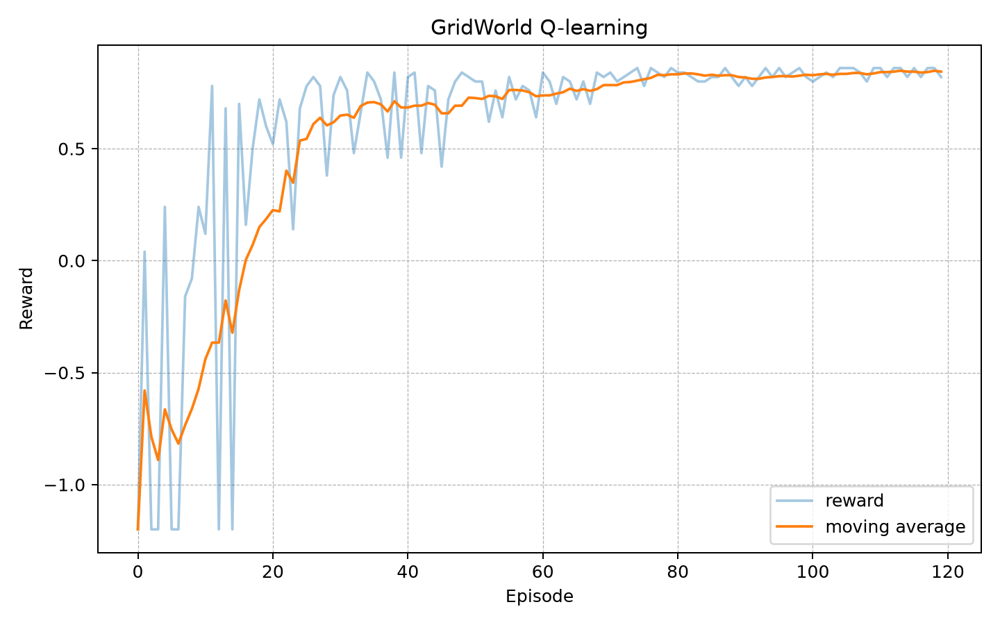
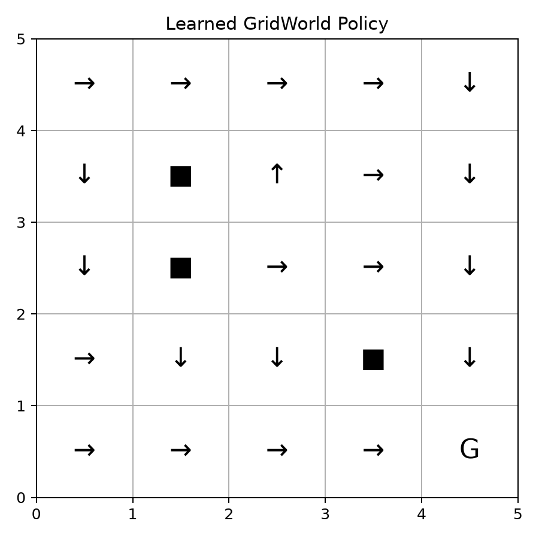

# RL Game Agents Lab

This repository contains small reinforcement learning experiments for solving game-like environments locally.

It includes:

- Tabular Q-learning on a small GridWorld
- DQN on CartPole
- REINFORCE policy gradient on CartPole
- DQN on a custom Mini-Atari-style Catch environment with pixel observations
- Replay buffer implementation
- Epsilon-greedy exploration
- Target network updates
- Training curves and rollout GIF generation
- Streamlit viewer
- Pytest tests

The goal is to show a compact end-to-end reinforcement learning portfolio project: environment, agent, training loop, evaluation, and visualization.

## Project Structure

```text
rl-game-agents-lab/
├── README.md
├── requirements.txt
├── requirements-minimal.txt
├── app.py
├── src/
│   ├── environments.py
│   ├── replay_buffer.py
│   ├── networks.py
│   ├── dqn.py
│   ├── policy_gradient.py
│   ├── q_learning.py
│   ├── metrics.py
│   └── visualize.py
├── scripts/
│   ├── run_gridworld_q_learning.py
│   ├── run_cartpole_dqn.py
│   ├── run_cartpole_policy_gradient.py
│   ├── run_mini_atari_dqn.py
│   └── run_all.py
├── results/
├── tests/
└── notebooks/
```

## Setup

```bash
python3 -m venv .venv
source .venv/bin/activate
pip install --upgrade pip
pip install -r requirements.txt
```

For a lighter install without Streamlit and Gymnasium:

```bash
pip install -r requirements-minimal.txt
```

## Run Tests

```bash
python -m pytest -q
```

Expected result:

```text
5 passed
```

## Run All Experiments

```bash
python scripts/run_all.py
```

This generates output files in `results/`.

## Individual Commands

### GridWorld Q-learning

```bash
python scripts/run_gridworld_q_learning.py --episodes 300
```

### CartPole DQN

```bash
python scripts/run_cartpole_dqn.py --episodes 80
```

### CartPole REINFORCE

```bash
python scripts/run_cartpole_policy_gradient.py --episodes 80
```

### Mini-Atari-style Catch DQN

```bash
python scripts/run_mini_atari_dqn.py --episodes 150
```

## Streamlit Viewer

```bash
streamlit run app.py
```

## Results

### GridWorld Q-learning



### GridWorld policy



After running all experiments, additional result files will be generated:

```text
results/cartpole_dqn_curve.png
results/cartpole_reinforce_curve.png
results/mini_atari_dqn_curve.png
results/mini_atari_rollout.gif
```

## What This Demonstrates

This repository demonstrates:

- Markov decision process style environments
- Tabular value learning
- Deep Q-learning
- Policy gradient learning
- Replay buffer sampling
- Target networks
- Exploration schedules
- Reward curves
- GIF-based rollout visualization

## Limitations

This is an educational implementation, not a production-grade RL framework.

- CartPole is solved with small local training settings
- The Mini-Atari environment is a custom lightweight Catch game, not full ALE Atari
- Results are stochastic and may vary by seed
- Hyperparameters are chosen for fast local execution

## Implemented Extensions

The following are implemented directly rather than left as future work:

- CartPole with DQN
- CartPole with policy gradient
- A custom Mini-Atari-style pixel environment
- A replay buffer
- A target network
- Evaluation rollouts
- GIF visualization
- Streamlit result viewer

## Future Work

Possible extensions:

- Add PPO
- Add vectorized environments
- Add prioritized replay
- Add Atari ALE support
- Add model-based RL
